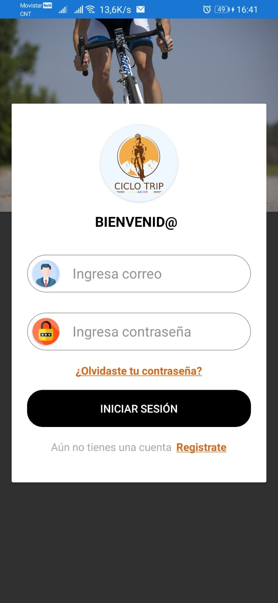
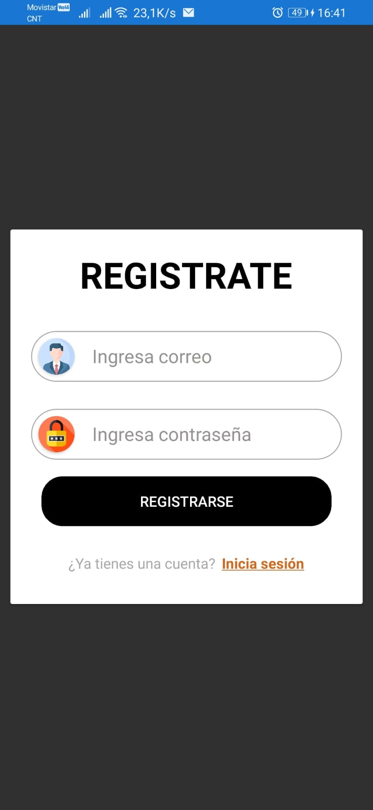
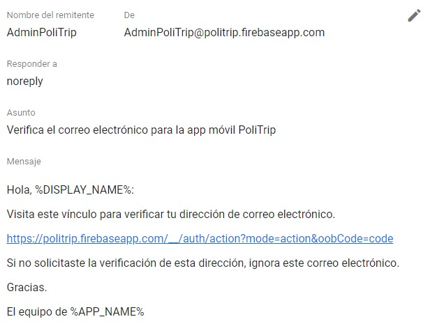
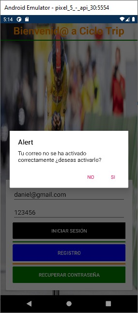
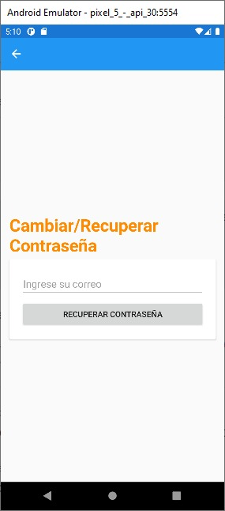
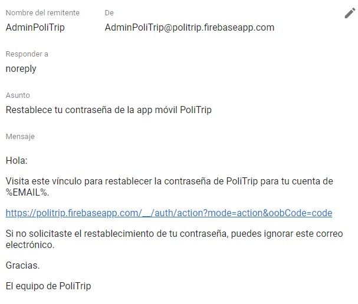
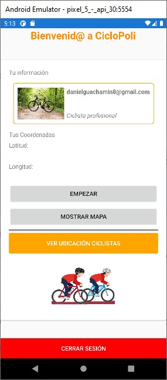
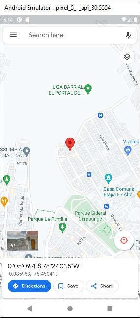
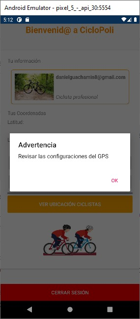

# PoliTrip

## Integrantes

* Denisse Cumbal
* Daniel Guachamín
* Jeremy León
* Cindy Yazán

El apk para android se encuentra dentro de este enlace → [Apk](https://epnecuador-my.sharepoint.com/:f:/g/personal/jeremy_leon_epn_edu_ec/EvIS9yRTABRPoMVAuEyhxloBa20794oHyM2YKhuck62L7w?e=NB6KaJ)

## Acerca del proyecto

<div align="center">
    
</div>

El presente proyecto implementea una aplicación móvil nativa enfocada a un grupo de ciclistas o corredores y ssaber la geolocalización de los demás miembros de su equipo de deportes. 🚴

La aplicación muestra la localización en Google Maps 🌍 de todos los miembros del grupo de ciclistas. Tiene la cualidad de seguir corriendo en segundo plano y realizar un registro de las ubicaciones en una base de datos cada 30 segundos. Además de contar con un registro e inicio de sesión con recuperación de contraseña y verificación de correo 📧, así tambien de tener una aplicación web que permite ver la información de la app móvil. 

### Registro 

El registro de un usuario nuevo es a través de correo electrónico y contraseña

<div align="center">
    
</div>

### Activación de la Cuenta

Al realizar el registro en la aplicación móvil esta envía un correo de verificación para activar la cuenta creada.

<div align="center">
    
</div>

### Recuperar Contraseña

La aplicación cuenta con la opción de recuperar contraseña por medio del correo registrado. El usuario resivirá un correo con un enlace para restablecer su contraseña.

<div align="center">
    
</div>

<div align="center">
    
</div>

<div align="center">
    
</div>

### Pantalla Principal (Dashboard)

Al ingresar a la aplicación se puede ver la información del usuario con la respectiva ubicación real y se puede visualizar esa ubicación en el mapa de Google. Como también la ubicación de los compañeros ciclistas registrados en la app.

<div align="center">
    
</div>

<div align="center">
    
</div>

Para saber la ubicación de la persona la app pide permisos para activar el GPS del dispositivo

<div align="center">
    
</div>

Una vez con los permisos se puede ver la ubicación de los ciclistas en una pantalla adicional

<div align="center">
    
</div>

### Sitio Web

A continuación, se puede ver la aplicación web con la información de la app móvil.


### Herramientas App Móvil

* [![XamarinForms][XamarinForms.com]][Xamarin-url]
* [![Firebase][Firebase.google.com]][Firebase-url]

### Herramientas App Web

* [![Angular][Angular.io]][Angular-url]
* [![Firebase][Firebase.google.com]][Firebase-url]

## Getting Started

### Instalación App Móvil

1. Clona el repositorio
   ```sh
   git clone https://github.com/DanielGuachamin/policiclo-ec.git
   ```
2. Inicia el proyecto en Visual Studio Code 2022, las dependencias se instalan por defecto.

### Instalación App Web

1. Clona el repositorio
   ```sh
   git clone https://github.com/DanielGuachamin/policiclo-ec.git
   ```
2. Instala las dependencias del proyecto
  	```sh
  	npm install 
  	```
 3. Levanta el servidor
 	```sh
  	ng serve --o 
  	```
## Anexos

Encuentra en el siguiente link el video de la explicación técnica del código

* [Video](https://clipchamp.com/watch/uIK4CbWSVae) 

También contamos con un video que explica la funcionalidad de las aplicaciones

* [Video](https://clipchamp.com/watch/uIK4CbWSVae) 

Puedes visitar la aplicación web dirigiendote al siguinete enlace

* [Sitio Web](https://ionicimagen-358b2.web.app/)


<!-- MARKDOWN LINKS & IMAGES -->

[XamarinForms.com]: https://img.shields.io/badge/Xamarin-800080?style=for-the-badge&logo=xamarin&logoColor=white
[Xamarin-url]: https://docs.microsoft.com/en-us/xamarin/xamarin-forms/
[Firebase.google.com]: https://img.shields.io/badge/Firebase-FFC300?style=for-the-badge&logo=firebase&logoColor=white
[Firebase-url]: https://firebase.google.com/
[Angular.io]: https://img.shields.io/badge/Angular-DD0031?style=for-the-badge&logo=angular&logoColor=white
[Angular-url]: https://angular.io/
